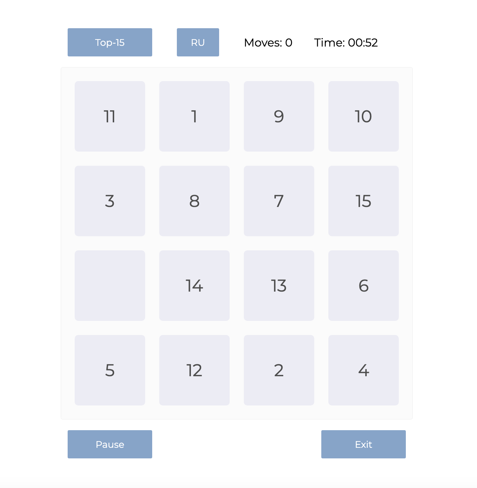
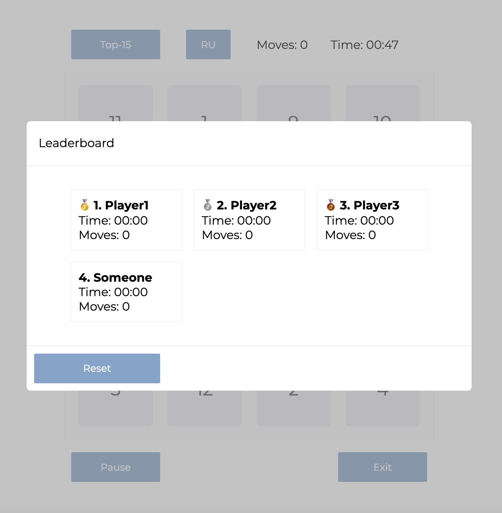
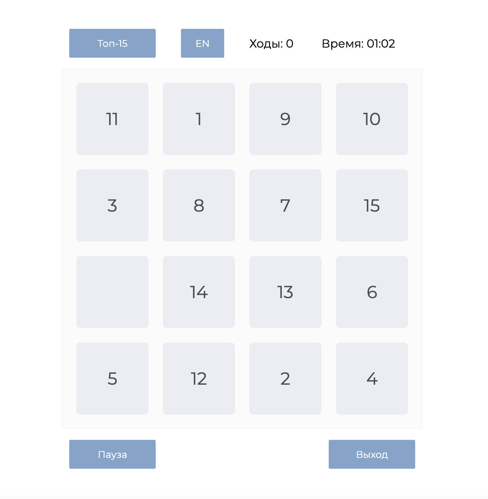
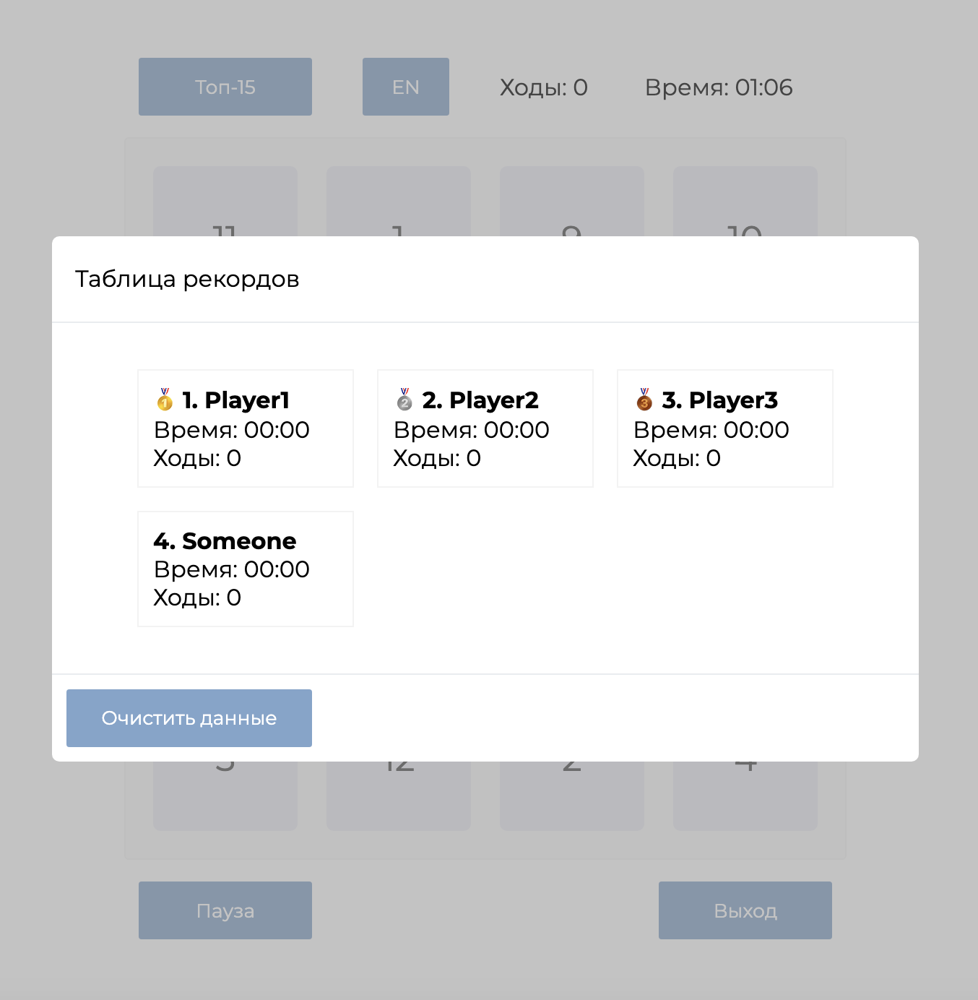

# 15 Puzzle Game

15 Puzzle Game is a classic logic puzzle featuring a 4x4 grid where you rearrange numbered tiles from 1 to 15 by sliding them into an empty space. Your goal is to organize the tiles in ascending order.

## Features

- Clean and intuitive UI displaying the number of moves and elapsed time.
- Leaderboard with top 15 best scores, including player name input.
- Bilingual support: English and Russian.
- Game controls: Start, Pause, and Exit.
- Smooth animations combined with a friendly and modern design.
  
## How to Play

- Press Start to begin the game.
- Slide tiles into the empty cell to arrange numbers from 1 to 15 in order.
- When you complete the puzzle, save your score to the leaderboard.

## Technical Details

- Built with JavaScript using React v19.1.0.0.
- State management through React hooks: useState and useEffect.
- Multi-language support implemented with the i18n library.
- Styling follows the BEM (Block Element Modifier) methodology for clear CSS structure.

## Roadmap
- Improve responsive layout for mobile and tablet
- Add effects when winning the game (e.g. confetti, animation, sound)
- Add subtle background animation or parallax effect for atmosphere

## Screenshot

--- --- --- --- --- --- --- --- --- --- --- --- 

# Пятнашки

Игра "Пятнашки" — классическая логическая головоломка с игровым полем 4x4, где нужно упорядочить фишки от 1 до 15, передвигая их через пустую клетку.

## Особенности

- Интуитивно понятный UI с отображением количества ходов и затраченного времени.
- Топ-15 лучших результатов с возможностью ввода имени.
- Поддержка двух языков: русский и английский.
- Управление состояниями игры: Старт, Пауза, Выход.
- Плавные анимации и дружелюбный стиль оформления.

## Как играть

- Нажмите "Старт" для начала игры.
- Перемещайте фишки в пустую клетку, чтобы собрать их в порядке от 1 до 15.
- После победы можно сохранить свой результат в таблицу лидеров.

## Технические детали

- Проект написан на **JavaScript** с использованием **React @19.1.0**.
- Управление состояниями реализовано через React-хуки: `useState` и `useEffect`.
- Для поддержки переключения языков использована библиотека **i18n**.
- CSS оформлен по методологии **BEM** (Block Element Modifier)

# Планы по улучшению
- Создать адаптивную верстку для мобильных устройств и планшетов
- Добавить эффекты при победе (конфетти, анимации, звуки)
- Добавить фоновое изображение (анимацию или параллакс эффект)

## Скриншот

